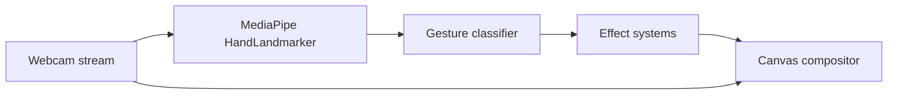
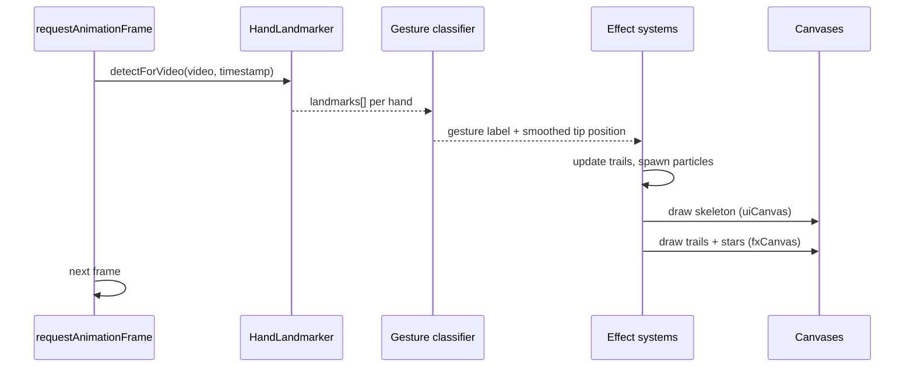
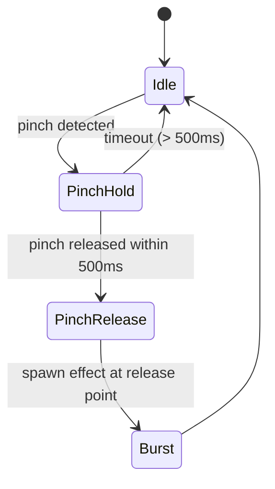
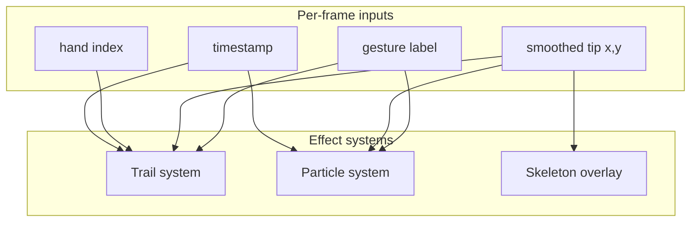
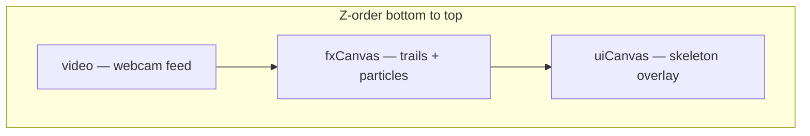

# Building Hand Gesture Tracking in the Browser

> **Status:** Historical / reference doc. **Not the current product spec.**
>
> [hand-wavy-wavy](https://hand-wavy-wavy.netlify.app/) today is a **fingertip-driven canvas visualization** app (no gesture classification). See [`implementation-plan.md`](./implementation-plan.md) for current intent.
>
> This guide describes an **older gesture + effects architecture** (rainbow trails, peace-sign burst, dual canvas) and reusable MediaPipe patterns. Useful for landmark indices, loop structure, and future effect work — but statements like “In hand-wavy-wavy:” below refer to that **legacy demo**, not the shipped codebase.

A practical guide to architecting real-time hand tracking, gesture classification, and canvas-based visual effects using [MediaPipe Hand Landmarker](https://developers.google.com/mediapipe/solutions/vision/hand_landmarker).

**Audience:** experienced developers who want architecture and working code, not a from-zero JavaScript primer.

**Scope:** hands and visual effects only. No face tracking, no backend, no app-navigation wiring.

---

## Table of contents

1. [System overview](#1-system-overview)
2. [Quick build walkthrough](#2-quick-build-walkthrough)
3. [The render loop](#3-the-render-loop)
4. [Hand landmarks and coordinate space](#4-hand-landmarks-and-coordinate-space)
5. [Gesture classification](#5-gesture-classification)
6. [Extending gestures](#6-extending-gestures)
7. [Visual effects architecture](#7-visual-effects-architecture)
8. [Dual-canvas layering](#8-dual-canvas-layering)
9. [Multi-hand state](#9-multi-hand-state)
10. [Performance tuning](#10-performance-tuning)
11. [Reference: landmark indices](#11-reference-landmark-indices)

---

## 1. System overview

The browser hand-tracking stack has four layers that run every frame:



| Layer | Responsibility |
|-------|----------------|
| **Capture** | `getUserMedia()` feeds a `<video>` element at native resolution |
| **Detection** | MediaPipe returns 21 normalized 2D landmarks per hand |
| **Classification** | Rule-based (or state-machine) logic maps landmarks → gesture labels |
| **Effects** | Trails, particles, skeleton overlays — driven by gesture + position |
| **Compositor** | Stacked canvases draw over the mirrored video feed |

Everything runs locally. Models load once from Google Cloud Storage; inference happens in WASM/WebGL via `@mediapipe/tasks-vision`.

**In hand-wavy-wavy:** all logic lives in a single entry module (~400 lines). The architecture is intentionally flat — one `requestAnimationFrame` loop owns detection, classification, and rendering. That is fine for a demo; the sections below describe how to split it if the effect systems grow.

---

## 2. Quick build walkthrough

These are the minimum pieces. Tooling (Vite, bundler, etc.) is irrelevant to the pattern — what matters is the sequence: load model → start camera → loop.

### 2.1 DOM structure

Stack a video element with two canvases on top. Canvases are `position: absolute` and sized to the video's native resolution (not CSS size).

```html
<div class="stage">
  <video id="webcam" autoplay playsinline muted></video>
  <canvas id="fxCanvas"></canvas>   <!-- persistent effects: trails, particles -->
  <canvas id="uiCanvas"></canvas>   <!-- transient overlay: skeleton, cleared each frame -->
</div>
```

Mirror the video for a natural selfie view:

```css
#webcam {
  transform: scaleX(-1);
}
```

You must flip X coordinates when drawing so overlays align with the mirrored feed (see [§4](#4-hand-landmarks-and-coordinate-space)).

### 2.2 Load MediaPipe and start the camera

```javascript
import {
  FilesetResolver,
  HandLandmarker,
} from "https://cdn.jsdelivr.net/npm/@mediapipe/tasks-vision@0.10.3";

const vision = await FilesetResolver.forVisionTasks(
  "https://cdn.jsdelivr.net/npm/@mediapipe/tasks-vision@0.10.3/wasm",
);

const handLandmarker = await HandLandmarker.createFromOptions(vision, {
  baseOptions: {
    modelAssetPath:
      "https://storage.googleapis.com/mediapipe-models/hand_landmarker/hand_landmarker/float16/1/hand_landmarker.task",
    delegate: "GPU",
  },
  runningMode: "VIDEO",
  numHands: 2,
});

const stream = await navigator.mediaDevices.getUserMedia({
  video: { width: 1280, height: 720, facingMode: "user" },
});

video.srcObject = stream;
video.addEventListener("loadeddata", () => {
  // Set canvas.width/height to video.videoWidth / video.videoHeight
  requestAnimationFrame(loop);
});
```

Key options:

- **`runningMode: "VIDEO"`** — required for `detectForVideo()`. Uses timestamps to avoid re-processing the same frame.
- **`delegate: "GPU"`** — WebGL acceleration. Fall back to `"CPU"` if needed.
- **`numHands: 2`** — doubles inference cost. Use `1` if you only need a single hand.

Serve over HTTP. `getUserMedia()` is blocked on `file://` URLs.

### 2.3 First detection — confirm tracking works

Before building effects, log the index fingertip to verify the pipeline:

```javascript
function loop(timestamp) {
  if (timestamp !== lastTimestamp) {
    lastTimestamp = timestamp;
    const results = handLandmarker.detectForVideo(video, timestamp);

    results.landmarks?.forEach((lm, i) => {
      const tip = lm[8]; // index fingertip
      console.log(`Hand ${i} tip: ${tip.x.toFixed(3)}, ${tip.y.toFixed(3)}`);
    });
  }
  requestAnimationFrame(loop);
}
```

Remove the log once confirmed — it fires at ~30 fps.

### 2.4 Draw the skeleton

Visual confirmation that landmarks track accurately. Define connections as index pairs and stroke between them:

```javascript
const CONNECTIONS = [
  [0, 1], [1, 2], [2, 3], [3, 4],       // thumb
  [0, 5], [5, 6], [6, 7], [7, 8],       // index
  [5, 9], [9, 10], [10, 11], [11, 12],  // middle
  [9, 13], [13, 14], [14, 15], [15, 16], // ring
  [13, 17], [17, 18], [18, 19], [19, 20], // pinky
  [0, 17],
];

function drawSkeleton(ctx, lm, mx, my) {
  ctx.strokeStyle = "rgba(255,255,255,0.4)";
  ctx.lineWidth = 1.5;
  CONNECTIONS.forEach(([a, b]) => {
    ctx.beginPath();
    ctx.moveTo(mx(lm[a]), my(lm[a]));
    ctx.lineTo(mx(lm[b]), my(lm[b]));
    ctx.stroke();
  });
}
```

At this point you have a working tracker with visual feedback. The rest of this doc covers gestures, effects, and production concerns.

---

## 3. The render loop

One loop drives everything. Do not split detection and rendering into separate timers — they will drift and cause visual jitter.



### Timestamp deduplication

`requestAnimationFrame` can fire faster than the video delivers new frames. Guard detection so each video frame is processed once:

```javascript
let lastTimestamp = -1;

function loop(timestamp) {
  if (timestamp !== lastTimestamp) {
    lastTimestamp = timestamp;
    const results = handLandmarker.detectForVideo(video, timestamp);
    // ... classify, update state
  }
  // ... always render (trails fade, particles animate even if no new detection)
  requestAnimationFrame(loop);
}
```

**Why render every frame but detect conditionally:** particle physics and trail fade depend on elapsed time, not just new landmark data. Stars fall with gravity between detections; old trail segments lose alpha continuously.

**In hand-wavy-wavy:** detection runs inside the `timestamp !== lastTimestamp` guard; trail expiry, spline drawing, and star physics run unconditionally every frame.

---

## 4. Hand landmarks and coordinate space

MediaPipe returns **21 landmarks per hand** as normalized `{ x, y, z }` where `x` and `y` are in `[0, 1]` relative to the image, and `y` increases downward.

### Mirroring

With a CSS-mirrored video, flip X when converting to canvas pixels:

```javascript
const mx = (p) => (1 - p.x) * canvasWidth;
const my = (p) => p.y * canvasHeight;
```

Without this flip, the skeleton and effects appear horizontally inverted relative to what the user sees.

### Handedness

MediaPipe reports `handedness` ("Left" / "Right") assuming a mirrored selfie camera. A detected "Left" hand is the user's actual left hand in front-facing mode.

### Index reference

Landmark indices are stable across MediaPipe SDKs. The ones you use most:

| Index | Joint |
|-------|-------|
| 0 | Wrist |
| 4 | Thumb tip |
| 8 | Index tip |
| 12 | Middle tip |
| 16 | Ring tip |
| 20 | Pinky tip |

Each finger chain is four consecutive indices (MCP → PIP → DIP → tip). The PIP joint is two indices below the tip — e.g. index PIP is landmark `6`, tip is `8`.

---

## 5. Gesture classification

### 5.1 The finger-up heuristic

The simplest reliable rule for front-facing webcams: a finger is "up" when its tip has a smaller Y value than its PIP joint (higher on screen = raised).

```javascript
function isFingerUp(lm, tipIndex) {
  const pipIndex = tipIndex - 2;
  return lm[tipIndex].y < lm[pipIndex].y;
}
```

Build a finger state vector:

```javascript
function getFingerState(lm) {
  return {
    thumb:  isFingerUp(lm, 4),
    index:  isFingerUp(lm, 8),
    middle: isFingerUp(lm, 12),
    ring:   isFingerUp(lm, 16),
    pinky:  isFingerUp(lm, 20),
  };
}
```

### 5.2 Basic gesture labels

Map finger combinations to named gestures. **In hand-wavy-wavy:**

```javascript
function classify(lm) {
  const up = (i) => lm[i].y < lm[i - 2].y;
  const indexUp = up(8);
  const middleUp = up(12);
  const ringUp = up(16);
  const pinkyUp = up(20);

  if (indexUp && middleUp && ringUp && pinkyUp) return "idle";
  if (indexUp && middleUp && !ringUp && !pinkyUp) return "burst";
  if (indexUp && !middleUp && !ringUp && !pinkyUp) return "draw";
  return "idle";
}
```

| Gesture | Fingers up | Visual effect |
|---------|-----------|---------------|
| `draw` | Index only | Rainbow trail follows fingertip |
| `burst` | Index + middle | Star particle explosion |
| `idle` | All four, or anything else | Pause drawing; existing trail fades |

Order matters — check the most specific patterns first (peace sign before single finger).

### 5.3 Gesture → effect dispatch

Keep classification and effects loosely coupled. A simple dispatch table is enough for visual-only apps:

```javascript
const GESTURE_EFFECTS = {
  draw:  (ctx, tip, handIdx) => appendTrailPoint(handIdx, tip),
  burst: (ctx, tip, handIdx) => { spawnStars(tip.x, tip.y, 12); clearTrail(handIdx); },
  idle:  () => {}, // trails fade on their own
};

// Inside the per-hand loop:
const gesture = classify(lm);
GESTURE_EFFECTS[gesture]?.(fxCtx, { x: tipX, y: tipY }, handIdx);
```

This keeps the loop readable and makes adding new gestures a matter of extending the classifier and the effect map.

---

## 6. Extending gestures

The finger-up heuristic covers pointing and peace-sign shapes well. For richer interaction, combine geometric checks and temporal state.

### 6.1 Pinch

Pinch = thumb tip close to index tip. Use normalized distance (scale-invariant):

```javascript
function dist(a, b) {
  return Math.hypot(a.x - b.x, a.y - b.y);
}

function isPinch(lm, threshold = 0.05) {
  return dist(lm[4], lm[8]) < threshold;
}
```

Tune `threshold` empirically — `0.04`–`0.06` works for most webcam distances. Visual effect example: pinch spawns a shrinking circle at the midpoint, or "grabs" a trail segment.

```javascript
function pinchMidpoint(lm) {
  return {
    x: (lm[4].x + lm[8].x) / 2,
    y: (lm[4].y + lm[8].y) / 2,
  };
}
```

### 6.2 Fist

All fingertips below their PIP joints:

```javascript
function isFist(lm) {
  const tips = [8, 12, 16, 20];
  return tips.every((tip) => !isFingerUp(lm, tip));
}
```

Effect idea: fist "cancels" the current trail immediately (stronger than idle) or triggers a shockwave ring from the wrist (landmark `0`).

### 6.3 Swipe / directional motion

Single-frame landmarks cannot detect swipes — you need velocity over time. Track the wrist or index tip across frames:

```javascript
const motionHistory = { 0: [], 1: [] }; // per hand, last N positions + timestamps

function recordPosition(handIdx, x, y, t) {
  const hist = motionHistory[handIdx];
  hist.push({ x, y, t });
  if (hist.length > 10) hist.shift();
}

function detectSwipe(handIdx, minSpeed = 800, minDistance = 0.08) {
  const hist = motionHistory[handIdx];
  if (hist.length < 4) return null;

  const first = hist[0];
  const last = hist[hist.length - 1];
  const dt = (last.t - first.t) / 1000; // seconds
  if (dt <= 0) return null;

  const dx = last.x - first.x;
  const dy = last.y - first.y;
  const distance = Math.hypot(dx, dy);
  const speed = distance / dt;

  if (speed < minSpeed || distance < minDistance) return null;

  const angle = Math.atan2(dy, dx);
  if (Math.abs(angle) < Math.PI / 4) return "swipe-right";
  if (Math.abs(angle) > (3 * Math.PI) / 4) return "swipe-left";
  if (angle < 0) return "swipe-up";
  return "swipe-down";
}
```

Use normalized coordinates for distance thresholds so swipes work at any distance from the camera. Effect idea: swipe-left clears all trails; swipe-right cycles rainbow palette.

### 6.4 Gesture state machines

For gestures that require a sequence or hold duration, use a per-hand finite state machine:



```javascript
const handState = { 0: "idle", 1: "idle" };
const pinchStart = { 0: null, 1: null };

function updateGestureState(handIdx, lm, now) {
  if (isPinch(lm)) {
    if (handState[handIdx] === "idle") {
      handState[handIdx] = "pinch-hold";
      pinchStart[handIdx] = now;
    }
  } else if (handState[handIdx] === "pinch-hold") {
    const held = now - pinchStart[handIdx];
    handState[handIdx] = "idle";
    if (held < 500) {
      // quick pinch-release → trigger effect
      return "pinch-tap";
    }
  }
  return classify(lm); // fall back to static classifier
}
```

State machines prevent ambiguous frames from flickering between labels — a common problem when fingers are mid-transition.

### 6.5 When rule-based classification breaks down

| Limitation | Mitigation |
|-----------|------------|
| Thumb direction varies | Use angle between thumb tip and index MCP instead of Y comparison for thumb |
| Hand rotation | Prefer distance/ratio features over absolute Y |
| Fast motion | Exponential smoothing + grace frames (see [§9](#9-multi-hand-state)) |
| Complex gestures (ASL letters, custom signs) | Train a lightweight classifier on landmark vectors, or use MediaPipe's Gesture Recognizer task |

For most visual-effect demos, rule-based classification on 21 points is sufficient and keeps latency near zero.

---

## 7. Visual effects architecture

Visual effects are independent systems fed by `(gesture, position, handIndex, timestamp)`. They should not call back into the detector.



### 7.1 Position smoothing

Raw landmark positions jitter. Apply exponential smoothing before feeding effects:

```javascript
const smoothTip = { 0: null, 1: null };
const SMOOTH = 0.55; // 0 = raw, 1 = frozen

function smoothPosition(handIdx, rawX, rawY) {
  if (!smoothTip[handIdx]) {
    smoothTip[handIdx] = { x: rawX, y: rawY };
  }
  smoothTip[handIdx].x = smoothTip[handIdx].x * SMOOTH + rawX * (1 - SMOOTH);
  smoothTip[handIdx].y = smoothTip[handIdx].y * SMOOTH + rawY * (1 - SMOOTH);
  return smoothTip[handIdx];
}
```

Lower `SMOOTH` (e.g. `0.3`) for snappier response; raise it (e.g. `0.7`) if the trail shimmers.

### 7.2 Rainbow trail system

Trails are time-stamped point arrays, one per hand:

```javascript
const handTrails = { 0: [], 1: [] };
const TRAIL_LIFETIME = 2200; // ms

function appendTrailPoint(handIdx, x, y, now) {
  const trail = handTrails[handIdx];
  const last = trail[trail.length - 1];
  const dist = last ? Math.hypot(x - last.x, y - last.y) : 0;

  if (!last || dist > 180) {
    // Teleport guard — hand reappeared far away, start fresh
    handTrails[handIdx] = [{ x, y, t: now }];
  } else if (dist >= 2) {
    trail.push({ x, y, t: now });
  }
}
```

**Point filtering:** the `dist >= 2` check avoids over-dense points when moving slowly. Raise to `6`–`8` on slow machines.

**Expiry:** each frame, remove points older than `TRAIL_LIFETIME`:

```javascript
const cutoff = now - TRAIL_LIFETIME;
while (trail.length && trail[0].t < cutoff) trail.shift();
```

**Rendering:** draw each of 7 colour bands as a Catmull-Rom spline offset perpendicular to the path tangent. Convert each segment to a cubic bezier for smooth curves. Fade alpha per segment based on point age:

```javascript
for (let i = 1; i < points.length; i++) {
  const age = now - points[i].t;
  const alpha = Math.max(0, 1 - age / TRAIL_LIFETIME) * 0.88;
  if (alpha <= 0) continue;
  ctx.globalAlpha = alpha;
  // bezierCurveTo(...) between offset band points
  ctx.stroke();
}
```

**In hand-wavy-wavy:** normals are precomputed per point from prev/next neighbours, then each rainbow band is offset by `(bandIndex - 3) * TRAIL_WIDTH * 0.9` pixels perpendicular to the path.

### 7.3 Particle system

Stars (or any particle) are a flat array of physics objects:

```javascript
const stars = [];
const MAX_STARS = 80;

function spawnStars(x, y, count = 14) {
  const canAdd = MAX_STARS - stars.length;
  if (canAdd <= 0) return;
  for (let i = 0; i < Math.min(count, canAdd); i++) {
    const angle = Math.random() * Math.PI * 2;
    const speed = 2 + Math.random() * 5;
    stars.push({
      x, y,
      vx: Math.cos(angle) * speed,
      vy: Math.sin(angle) * speed - 3,
      color: RAINBOW[Math.floor(Math.random() * RAINBOW.length)],
      size: 3 + Math.random() * 5,
      age: 0,
      maxAge: 500 + Math.random() * 400,
      rotation: Math.random() * Math.PI * 2,
      rotSpeed: (Math.random() - 0.5) * 0.3,
    });
  }
}
```

Update each frame (runs even when no new detection):

```javascript
const dt = 16; // ~ms per frame
for (let i = stars.length - 1; i >= 0; i--) {
  const s = stars[i];
  s.age += dt;
  if (s.age > s.maxAge) { stars.splice(i, 1); continue; }
  s.vy += 0.18;       // gravity
  s.x += s.vx;
  s.y += s.vy;
  s.vx *= 0.99;       // drag
  s.rotation += s.rotSpeed;
  drawStar(ctx, s.x, s.y, s.size, s.rotation, 1 - s.age / s.maxAge, s.color);
}
```

Hard-cap the pool (`MAX_STARS`). Without it, holding the burst gesture generates unbounded particles and frame times spike.

### 7.4 Skeleton overlay

The skeleton is cheap to draw and gives immediate feedback on tracking quality. Colour it by gesture for debugging:

```javascript
const skeletonColor =
  gesture === "draw"  ? "rgba(199,125,255,0.5)" :
  gesture === "burst" ? "rgba(255,217,61,0.6)"  :
                        "rgba(255,255,255,0.2)";
```

Highlight the index tip (landmark `8`) with a larger dot — it is the anchor for draw and burst effects.

---

## 8. Dual-canvas layering



| Canvas | Cleared | Contents | Rationale |
|--------|---------|----------|-----------|
| `fxCanvas` | Every frame (full clear) | Rainbow trails, particles | Effects are redrawn from state arrays each frame — no need to persist pixels |
| `uiCanvas` | Every frame | Skeleton, debug labels | Transient overlay that must not leave ghost lines |

Both canvases are sized to the video's **native** resolution (`video.videoWidth × video.videoHeight`), then scaled by CSS. Drawing in native resolution keeps landmark-to-pixel mapping exact.

**Why two canvases instead of one?**

- Different update semantics — skeleton is ephemeral; trails are state-driven but fully re-rendered from arrays.
- Easier to toggle debug overlay without touching effect rendering.
- If you later add post-processing (blur, composite modes), you can target `fxCanvas` independently.

**In hand-wavy-wavy:** `fxCtx.clearRect()` then redraw all trails and stars; `uiCtx.clearRect()` then redraw all skeletons. Both happen every frame.

---

## 9. Multi-hand state

When `numHands: 2`, treat each hand index as an independent state bucket:

```javascript
const handTrails  = { 0: [], 1: [] };
const smoothTip   = { 0: null, 1: null };
const handMissed  = { 0: 0, 1: 0 };
const GRACE_FRAMES = 6; // ~200ms at 30fps
```

### Grace period for dropped frames

MediaPipe occasionally misses a hand for a single frame. Without a grace period, trails vanish instantly:

```javascript
if (results.landmarks?.length > 0) {
  results.landmarks.forEach((lm, handIdx) => {
    handMissed[handIdx] = 0;
    // ... classify and update
  });

  // Hand 1 absent this frame but was present before?
  if (results.landmarks.length < 2) {
    handMissed[1]++;
    if (handMissed[1] > GRACE_FRAMES) {
      handTrails[1] = [];
      smoothTip[1] = null;
    }
  }
} else {
  [0, 1].forEach((hi) => {
    handMissed[hi]++;
    if (handMissed[hi] > GRACE_FRAMES) {
      handTrails[hi] = [];
      smoothTip[hi] = null;
    }
  });
}
```

Raise `GRACE_FRAMES` if trails still flicker away; lower it for faster cleanup when the hand actually leaves frame.

---

## 10. Performance tuning

Hand landmarker inference dominates cost. Everything else is canvas draw calls.

### Detection

| Knob | Effect |
|------|--------|
| `numHands: 1` | Roughly halves detection time |
| `delegate: "GPU"` | WebGL path; fall back to CPU only on failure |
| Lower camera resolution | Less pixel data to process (try 640×480) |

### Rendering

| Knob | Effect |
|------|--------|
| `MAX_STARS` | Cap particle pool (80 → 40 on older hardware) |
| Avoid `shadowBlur` on particles | Each blur is a full GPU pass — fine on trail segments, expensive on 80 particles |
| Trail point distance threshold | `dist >= 2` → `6` or `8` reduces spline segments |
| `TRAIL_LIFETIME` | Shorter lifetime = fewer points alive at once |
| `SMOOTH` | Higher smoothing reduces visual jitter without extra compute |

### Memory

Trail arrays and particle pools are the only growing structures. Both are bounded:

- Trails: points expire by timestamp.
- Particles: hard cap + splice on expiry.

No object pooling is needed at demo scale. If `MAX_STARS` bursts are frequent, reuse particle objects instead of allocating new ones.

### Profiling

Use Chrome DevTools Performance tab. Watch for:

- Long `detectForVideo` calls → reduce hands or resolution.
- High `drawCall` count → reduce trail segments or particle count.
- GC spikes → reuse objects in the particle pool.

---

## 11. Reference: landmark indices

```
        8   12  16  20
        |   |   |   |
    7   11  15  19
    |   |   |   |
    6   10  14  18
    |   |   |   |
    5   9   13  17
     \   |   |   /
       \  |   |  /
         0 (wrist)
    1-4: thumb chain
```

| Tip | Index | PIP (tip − 2) |
|-----|-------|---------------|
| Thumb | 4 | 2 |
| Index | 8 | 6 |
| Middle | 12 | 10 |
| Ring | 16 | 14 |
| Pinky | 20 | 18 |

---

## Further reading

- [MediaPipe Hand Landmarker docs](https://developers.google.com/mediapipe/solutions/vision/hand_landmarker)
- [MediaPipe Tasks Vision (CDN)](https://cdn.jsdelivr.net/npm/@mediapipe/tasks-vision@0.10.3)
- [hand-wavy-wavy live demo](https://hand-wavy-wavy.netlify.app/)
- [Sander Desnaijer — MediaPipe hand tracking tutorial](https://www.sanderdesnaijer.com/blog/mediapipe-hand-face-tracking) (hands section; same gesture and trail patterns)
