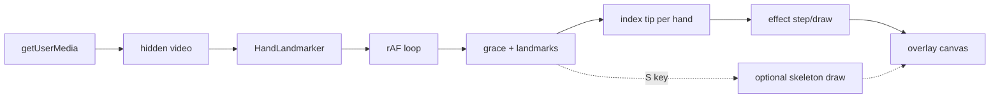

# Implementation plan: hand-wavy-wavy

Living product doc for [hand-wavy-wavy](https://hand-wavy-wavy.netlify.app/). Supersedes the v1-only skeleton scope and the gesture/effect-heavy scope in [building-hand-gesture-tracking.md](./building-hand-gesture-tracking.md).

**Product intent:** Real-time finger tracking drives canvas visualizations. No gesture classification. The hand is an input device; effects are ethereal, bio-luminescent streams (aesthetic references in [`visuals/`](../visuals/) — reference only, not shipped).

**Current phase:** v1 complete → v2 in progress (Fibrous effect first).

---

## Locked decisions

| Topic | Choice |
|--------|--------|
| **Input** | Index fingertip (landmark `8`) per hand — primary effect driver |
| **Skeleton** | Full 21-landmark tracking + draw logic **retained**; hidden by default |
| **Skeleton toggle** | `S` key at runtime (no on-screen UI) |
| **Effects** | Canvas visualizations influenced by fingertip position; no gesture labels |
| **v2 first effect** | **Fibrous** — swaying fiber column follows fingertip X |
| **Two hands** | Up to two columns (one per hand), colors from `HAND_COLORS` |
| **Effect params** | Port defaults from `visuals/` explorations, **scale-aware** for full viewport |
| **Effect code layout** | `src/effects/effectBase.ts` + `src/effects/fibrous.ts`; wired from `loop.ts` |
| **Not in scope** | Gesture classification, rainbow-trail/peace-sign FSM, visible video toggle (unless requested) |
| **MediaPipe** | npm `@mediapipe/tasks-vision@0.10.3`; `delegate: "GPU"` with CPU fallback |
| **Hands** | `numHands: 2`; grace period ~6 frames before clearing per-hand state |
| **Video** | Hidden `<video>` for `detectForVideo`; skeleton/effects-only UI |
| **Canvas** | Viewport-sized overlay via `canvasLayout.ts`; cover-fit transform; internal coords match camera space |
| **Coordinates** | `MIRROR_X = true` (`mx = (1 - x) * width`) in `landmarks.ts` |
| **Camera** | `getUserMedia({ video: { width: 640, height: 480, facingMode: "user" } })` |
| **Stage** | Near-black background (`#0a0a0a`) |
| **Status UI** | Minimal centered text: loading, permission, errors |
| **Debug** | `SHOW_DEBUG = false`; when true, draw MediaPipe handedness labels near wrist |
| **Stack** | TypeScript + Vite; **pnpm**; no backend |

---

## Architecture



| Layer | Responsibility |
|-------|----------------|
| **Capture** | `getUserMedia()` → hidden `<video>` at 640×480 |
| **Detection** | MediaPipe returns 21 normalized landmarks per hand |
| **State** | Per-hand grace counters; full skeleton kept for future use |
| **Effect input** | Landmark `8` (index tip) per hand, mapped via `mx`/`my` |
| **Render** | Effect fade + draw; optionally skeleton overlay when toggled |

Everything runs locally. No backend.

---

## File layout

```
src/
  main.ts           # DOM, status, MediaPipe + camera init, keyboard (S → skeleton)
  loop.ts           # rAF, detect, grace, effect step/draw, optional skeleton
  draw.ts           # skeleton connections + dots (used when skeleton visible)
  landmarks.ts      # CONNECTIONS, mx/my, MIRROR_X, HAND_COLORS, flags
  canvasLayout.ts   # viewport canvas sizing, DPR, cover-fit transform
  effects/
    effectBase.ts   # fade, rgba, shared helpers for all effects
    fibrous.ts      # Fibrous effect (v2 first ship)
index.html          # stage, hidden video, overlay canvas, status
src/style.css       # dark full-viewport stage
visuals/            # motion explorations (reference only; not in build)
```

MediaPipe init lives in `main.ts`. WASM loads from `public/mediapipe-wasm/` (copied by Vite plugin on dev/build), with jsDelivr CDN fallback.

---

## v1 (complete)

Minimal hand skeleton tracker — foundation for detection and coordinate mapping.

- [x] Dark stage, hidden video, overlay canvas
- [x] MediaPipe Hand Landmarker, GPU → CPU fallback
- [x] Two hands, per-hand colors, 6-frame grace period
- [x] `canvasLayout.ts` viewport scaling (not native-size canvas + CSS only)
- [x] Status flow: `Loading…` → `Starting camera…` → `Loading hand tracker…` → `Ready` (hidden)

---

## v2 — Fibrous (target)

Port **06 · Fibrous** from [`visuals/gestures.jsx`](../visuals/gestures.jsx).

### Behavior

- Reference implementation: vertical sine-sway fibers at fixed `x0` columns across the canvas.
- **Product change:** each detected hand gets one fiber **column centered on index tip X** (column follow).
- Fiber count scales with canvas/camera width (reference: `n ≈ width / 3.5`).
- Default appearance derived from explorations tweaks, adjusted for full viewport:

| Param | Reference (`visuals/`) | v2 note |
|-------|------------------------|---------|
| speed | `3` | keep ratio; may tune |
| opacity | `0.72` | keep |
| trail (fade) | `0.23` | scale fade for viewport |
| glow | `20` | bump slightly for full-screen |
| color | `#ffffff` | default; per-hand tint optional later |

### Render order (each frame)

1. Partial fade (effect persistence)
2. `fibrous.step(dt)` / `fibrous.draw(ctx)` per hand at tip position
3. If skeleton toggled (`S`): draw skeleton on top

### Loop contract

Detection unchanged from v1. Effect `step`/`draw` run every frame; `detectForVideo` only when `timestamp !== lastTimestamp`.

---

## Dependencies

```bash
pnpm add @mediapipe/tasks-vision@0.10.3
```

Model asset:

```
https://storage.googleapis.com/mediapipe-models/hand_landmarker/hand_landmarker/float16/1/hand_landmarker.task
```

Hand landmarker options:

```typescript
{
  baseOptions: {
    modelAssetPath: "<url above>",
    delegate: "GPU", // retry with "CPU" on failure
  },
  runningMode: "VIDEO",
  numHands: 2,
}
```

---

## DOM structure

```html
<div class="stage">
  <p id="status">Loading…</p>
  <video id="webcam" autoplay playsinline muted hidden></video>
  <canvas id="overlay"></canvas>
</div>
```

---

## Constants

| Constant | Value | Location |
|----------|-------|----------|
| `GRACE_FRAMES` | 6 | `landmarks.ts` |
| `MIRROR_X` | `true` | `landmarks.ts` |
| `SHOW_DEBUG` | `false` | `landmarks.ts` |
| Skeleton visible | `false` default; `S` toggles | runtime in `main.ts` / `loop.ts` |

---

## Manual test checklist

### v1 / detection (still applies)

- [ ] Camera permission denied → status error, no crash
- [ ] One hand → tracking works
- [ ] Two hands → two slots, no index swap flicker
- [ ] Hand leaves frame → state clears after ~6 frame grace
- [ ] `MIRROR_X = true` → moving hand left moves overlay left
- [ ] `SHOW_DEBUG = true` → handedness labels visible
- [ ] Window resize → cover-fit scale OK

### v2 / Fibrous (when implemented)

- [ ] Default view: fibers only, no skeleton
- [ ] `S` toggles skeleton overlay on/off
- [ ] One hand → one fiber column follows index tip X
- [ ] Two hands → two columns, distinct colors
- [ ] Hand dropout → column fades with grace (no instant pop)
- [ ] Full viewport: glow/trail readable (scale-aware defaults)

---

## Later (not committed)

| Feature | Notes |
|---------|--------|
| More effects | Port from `visuals/` registry; key/picker cycle |
| Per-hand effect types | Different visualization per hand index |
| Full skeleton as input | Joints beyond tip drive emitters/fields |
| Visible mirrored video | Remove `hidden`, CSS `scaleX(-1)`, keep `MIRROR_X` |
| Position smoothing | If tip jitter distracts |
| Gesture classification | Explicitly out of scope unless requested |

---

## Reference docs

- [building-hand-gesture-tracking.md](./building-hand-gesture-tracking.md) — **historical / future reference** for gesture labels, dual-canvas effects, trails, particles (old demo architecture; not current product)
- [MediaPipe Hand Landmarker](https://developers.google.com/mediapipe/solutions/vision/hand_landmarker)
- Landmark indices: wrist `0`, index tip `8`, other tips `4, 12, 16, 20`
