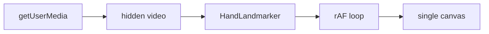

# Implementation plan: minimal hand skeleton tracker

This plan reflects decisions from the design review for rebuilding [hand-wavy-wavy](https://hand-wavy-wavy.netlify.app/) after the repo reset. It supersedes gesture/effect-heavy scope in [building-hand-gesture-tracking.md](./building-hand-gesture-tracking.md) for **v1**.

**v1 goal:** Track up to two hands in the browser, draw 21 landmarks per hand with connecting lines on a canvas. No gesture classification, trails, or particles.

**Success criteria:** Stable skeleton overlay on a dark stage; two distinguishable hand colors; brief dropout does not flicker; works on `pnpm dev` (HTTPS/localhost) and production deploy.

---

## Locked decisions

| Topic | Choice |
|--------|--------|
| **Features** | Hand + finger tracking only; 21 landmarks; bone lines; uniform joint dots |
| **Not in v1** | Gestures, rainbow trails, star particles, video visibility toggle, position smoothing |
| **MediaPipe** | npm `@mediapipe/tasks-vision@0.10.3`; `delegate: "GPU"` with CPU fallback on init failure |
| **Hands** | `numHands: 2`; draw both when present; per-hand colors |
| **Dropout** | Grace period ~6 frames before clearing per-hand state |
| **Video** | Hidden `<video>` required for `detectForVideo`; skeleton-only UI; visible mirrored video in a later pass |
| **Canvas** | Single overlay; `width/height` = `video.videoWidth/Height`; CSS scales stage to viewport |
| **Coordinates** | `MIRROR_X = true` by default (`mx = (1 - x) * width`); constant in `landmarks.ts` for future toggle |
| **Camera** | `getUserMedia({ video: { width: 640, height: 480, facingMode: "user" } })` |
| **Stage** | Near-black background (`#0a0a0a` or similar) |
| **Status UI** | Minimal centered text: loading, permission, errors |
| **Debug** | `SHOW_DEBUG = false`; when true, draw MediaPipe handedness labels near wrist |
| **File layout** | Hybrid 4 files (see below) |

---

## Architecture



| Layer | Responsibility |
|-------|----------------|
| **Capture** | `getUserMedia()` → hidden `<video>` at 640×480 |
| **Detection** | MediaPipe returns 21 normalized landmarks per hand |
| **State** | Per-hand grace counters when landmarks missing |
| **Render** | Clear canvas → draw connections + dots (per-hand color) |

Everything runs locally. No backend.

---

## File layout

```
src/
  main.ts          # DOM, status text, init MediaPipe + camera, start loop
  loop.ts          # requestAnimationFrame, timestamp dedup, detect, grace, call draw
  draw.ts          # clear canvas, draw skeleton per hand
  landmarks.ts     # CONNECTIONS, mx/my, MIRROR_X, per-hand colors, SHOW_DEBUG
index.html         # stage, hidden video, single canvas, status element
src/style.css      # dark stage, stacked video + canvas, native-size canvas scaled by CSS
```

MediaPipe init lives in `main.ts` or a small inline block there (~30 lines). Extract `handLandmarker.ts` only if `main.ts` grows unwieldy.

---

## Dependencies

```bash
pnpm add @mediapipe/tasks-vision@0.10.3
```

Model asset (unchanged from architecture doc):

```
https://storage.googleapis.com/mediapipe-models/hand_landmarker/hand_landmarker/float16/1/hand_landmarker.task
```

WASM: resolve via `FilesetResolver.forVisionTasks` using paths from the installed package (fall back to jsDelivr WASM URL only if bundler path fails).

Hand landmarker options:

```typescript
{
  baseOptions: {
    modelAssetPath: "<url above>",
    delegate: "GPU", // retry with "CPU" on failure
  },
  runningMode: "VIDEO",
  numHands: 2,
}
```

---

## DOM structure

```html
<div class="stage">
  <p id="status">Loading…</p>
  <video id="webcam" autoplay playsinline muted hidden></video>
  <canvas id="overlay"></canvas>
</div>
```

- Video is `hidden` (or off-screen) in v1 — still drives canvas dimensions and detection.
- When visible video is added later: remove `hidden`, apply `transform: scaleX(-1)` on video, keep `MIRROR_X` aligned.

---

## Render loop contract

```typescript
function loop(timestamp: number) {
  if (timestamp !== lastTimestamp) {
    lastTimestamp = timestamp;
    const results = handLandmarker.detectForVideo(video, timestamp);
    updateGraceState(results); // handMissed[0|1], clear after GRACE_FRAMES
    lastResults = results;     // keep for draw during grace
  }
  drawSkeleton(overlayCtx, lastResults, video.videoWidth, video.videoHeight);
  requestAnimationFrame(loop);
}
```

- **Detect** inside `timestamp !== lastTimestamp` guard (one inference per video frame).
- **Draw** every frame (grace may show last known landmarks).

Constants:

| Constant | Value |
|----------|-------|
| `GRACE_FRAMES` | 6 |
| `MIRROR_X` | `true` (default) |
| `SHOW_DEBUG` | `false` (default) |

---

## Drawing

### Connections

Use the standard MediaPipe hand graph (see [building-hand-gesture-tracking.md §2.4](./building-hand-gesture-tracking.md)):

```typescript
const CONNECTIONS = [
  [0, 1], [1, 2], [2, 3], [3, 4],
  [0, 5], [5, 6], [6, 7], [7, 8],
  [5, 9], [9, 10], [10, 11], [11, 12],
  [9, 13], [13, 14], [14, 15], [15, 16],
  [13, 17], [17, 18], [18, 19], [19, 20],
  [0, 17],
];
```

### Coordinate helpers (`landmarks.ts`)

```typescript
export const MIRROR_X = true;

export function mx(p: { x: number }, width: number): number {
  return (MIRROR_X ? 1 - p.x : p.x) * width;
}
export function my(p: { y: number }, height: number): number {
  return p.y * height;
}
```

### Per-hand colors

- Hand 0: e.g. `rgba(199, 125, 255, 0.7)` (purple)
- Hand 1: e.g. `rgba(125, 200, 255, 0.7)` (cyan)

Uniform styling: same line width (~1.5px) and dot radius (~4px) for all landmarks.

### Debug labels

When `SHOW_DEBUG` is true, draw `handedness` text near landmark 0 (wrist) using that hand’s color.

---

## Implementation phases

### Phase 1 — Stage, camera, status

1. Update `index.html` and `style.css`: dark full-viewport stage, centered status, hidden video, single canvas absolutely positioned over video.
2. On `video.loadeddata`, set `canvas.width/height` from `video.videoWidth/Height`.
3. `getUserMedia` with 640×480 user-facing camera; pipe to video.
4. Status transitions: `Loading…` → `Starting camera…` → `Ready` (hide or clear when drawing).

**Verify:** Status updates; no blank hang; camera denial shows readable error.

### Phase 2 — MediaPipe + loop

1. Install `@mediapipe/tasks-vision`; create hand landmarker (GPU, CPU fallback).
2. Implement `loop.ts` with timestamp deduplication.
3. Temporary: log index tip (landmark 8) per hand to console; remove before Phase 3.

**Verify:** Console shows stable normalized coordinates when moving hands.

### Phase 3 — Skeleton render

1. `landmarks.ts`: `CONNECTIONS`, `mx`/`my`, colors, flags.
2. `draw.ts`: stroke connections, fill uniform dots per landmark.
3. `loop.ts`: grace-period state — retain last landmarks for up to 6 missed frames per hand index.

**Verify:** Two hands get distinct colors; skeleton tracks movement; brief occlusion does not blink off instantly.

### Phase 4 — Polish

1. Remove debug logging.
2. Confirm GPU/CPU fallback path.
3. If landmark shimmer is distracting, add optional smoothing (tips only) — not required for v1.
4. `pnpm build` + deploy smoke test (camera requires HTTPS).

**Verify:** Chrome Performance — `detectForVideo` acceptable at 640×480 with 2 hands.

---

## Manual test checklist

- [ ] Camera permission denied → status error, no crash
- [ ] One hand → skeleton appears, correct color
- [ ] Two hands → two colors, no index swap flicker
- [ ] Hand leaves frame → skeleton clears after ~200ms grace, not instantly on one-frame miss
- [ ] `MIRROR_X = true` → moving hand left moves skeleton left on screen
- [ ] `SHOW_DEBUG = true` → handedness labels visible
- [ ] Window resize → CSS scale OK; canvas internal size still matches video

---

## Later (explicitly out of v1)

From [building-hand-gesture-tracking.md](./building-hand-gesture-tracking.md), when needed:

| Feature | Notes |
|---------|--------|
| Visible mirrored video | Remove `hidden`, CSS `scaleX(-1)`, keep `MIRROR_X` |
| Video toggle | Key or button; detection keeps running |
| Position smoothing | Exponential smooth on tips if jitter bad |
| Gestures + effects | `classify()`, trails, particles, dual canvas |
| Pinch / swipe / FSM | §6 extensions |

---

## Reference

- [building-hand-gesture-tracking.md](./building-hand-gesture-tracking.md) — full gesture/effect architecture (future)
- [MediaPipe Hand Landmarker](https://developers.google.com/mediapipe/solutions/vision/hand_landmarker)
- Landmark indices: wrist `0`, tips `4, 8, 12, 16, 20`
