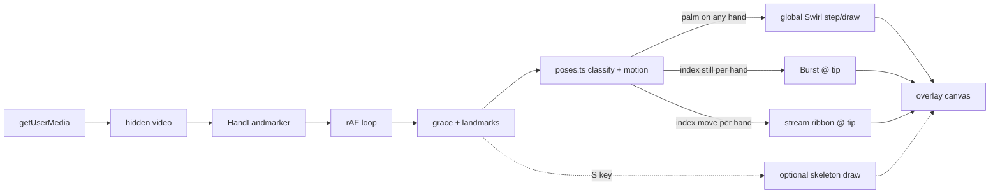

# Implementation plan: hand-wavy-wavy

Living product doc for [hand-wavy-wavy](https://hand-wavy-wavy.netlify.app/). Supersedes the v1-only skeleton scope, the cross-hand Fibrous v2 spec, and the gesture/effect-heavy scope in [building-hand-gesture-tracking.md](./building-hand-gesture-tracking.md).

**Product intent:** Real-time hand **pose + motion** classification drives canvas visualizations. Three poses map to three effects (aesthetic references in [`visuals/`](../visuals/) — reference only, not shipped). The hand is an input device; effects are ethereal, bio-luminescent streams that fade in and out.

**Current phase:** v1 complete → v2 in progress (pose router + three effects).

---

## Locked decisions

| Topic | Choice |
|--------|--------|
| **Product model** | **Pose-routed effects** — landmark heuristics classify hand shape + motion; no ML gesture classifier |
| **Pose vocabulary (v2)** | **3 poses → 3 effects** (see table below); unrecognized → silent rest per hand |
| **Scope layering** | **Hybrid:** open palm → **global** Swirl field; index poses → **per-hand** Burst / stream |
| **Palm → Swirl** | Open palm facing camera summons a full-screen Swirl (rings + smoke dots from `visuals/`) |
| **Index still → Burst** | Index-only pose, fingertip **stationary** → radial smoke burst anchored at index tip (landmark `8`) |
| **Index moving → stream** | Index-only pose, fingertip **moving** → flowing ribbon/trail from tip; **must leave a trail and fade out** (not column Fibrous) |
| **Index motion gate** | EMA-smoothed tip velocity + **~200 ms sustained hold** before switching Burst ↔ stream |
| **Swirl spawn rule** | Palm **still** → generate rings/dots (populate screen over time) |
| **Swirl displacement rule** | Palm **moving** → **stop spawning**; displace existing particles along palm motion so they float/drift away (curl-assisted) |
| **Palm detection** | Finger extension **+** palm plane normal roughly toward camera (wrist + index/pinky MCP) |
| **Unrecognized pose** | Per-hand silent rest with existing **6-frame grace** fade; does not cancel other hands or global Swirl |
| **Simultaneous effects** | Swirl (global) + per-hand Burst/stream on other hand(s) allowed |
| **Skeleton** | Full 21-landmark tracking + draw logic **retained**; hidden by default |
| **Skeleton toggle** | `S` key at runtime (no on-screen UI) |
| **Effect params** | Port defaults from `visuals/` explorations, **scale-aware** for full viewport |
| **Effect code layout** | `src/effects/effectBase.ts` + one file per effect; `src/poses.ts` for classification; wired from `loop.ts` |
| **Not in scope (v2)** | 9-pose full map, peace-sign FSM, effect picker UI, visible video toggle (unless requested) |
| **MediaPipe** | npm `@mediapipe/tasks-vision@0.10.3`; `delegate: "GPU"` with CPU fallback |
| **Hands** | `numHands: 2`; grace period ~6 frames before clearing per-hand state |
| **Video** | Hidden `<video>` for `detectForVideo`; skeleton/effects-only UI |
| **Canvas** | Viewport-sized overlay via `canvasLayout.ts`; cover-fit transform; internal coords match camera space |
| **Coordinates** | `MIRROR_X = true` (`mx = (1 - x) * width`) in `landmarks.ts` |
| **Camera** | `getUserMedia({ video: { width: 640, height: 480, facingMode: "user" } })` |
| **Stage** | Near-black background (`#0a0a0a`) |
| **Status UI** | Minimal centered text: loading, permission, errors |
| **Debug** | `SHOW_DEBUG = false`; when true, draw MediaPipe handedness labels near wrist |
| **Stack** | TypeScript + Vite; **pnpm**; no backend |

### Pose → effect map

| Pose | Detection (summary) | Effect | Scope | Reference |
|------|---------------------|--------|-------|-----------|
| **Open palm** | All fingers extended; palm normal toward camera | **Swirl** | Global (any qualifying hand) | `09 · Swirl` in [`visuals/gestures.jsx`](../visuals/gestures.jsx) |
| **Index stationary** | Index-only extension; smoothed tip speed below threshold ~200 ms | **Burst** | Per hand @ index tip | `08 · Burst` |
| **Index moving** | Index-only extension; smoothed tip speed above threshold ~200 ms | **Stream** (product label: moving-index trail; **not** cross-hand Fibrous) | Per hand @ index tip | Trail/ribbon behavior; partial reuse of Burst/Wisps trail helpers |
| **Other / fist / partial** | Does not match above | **None** | Per hand | Grace fade only |

---

## Architecture



| Layer | Responsibility |
|-------|----------------|
| **Capture** | `getUserMedia()` → hidden `<video>` at 640×480 |
| **Detection** | MediaPipe returns 21 normalized landmarks per hand |
| **State** | Per-hand grace counters; smoothed tip + palm centroid velocities |
| **Pose** | `poses.ts`: palm vs index-only vs none; palm still/moving; index still/moving with hold timers |
| **Effects** | Global Swirl field; per-hand Burst and stream emitters at landmark `8` |
| **Render** | Shared partial fade; effect step/draw; optional skeleton overlay when toggled |

Everything runs locally. No backend.

---

## File layout

```
src/
  main.ts           # DOM, status, MediaPipe + camera init, keyboard (S → skeleton)
  loop.ts           # rAF, detect, grace, pose classify, effect step/draw, optional skeleton
  poses.ts          # palm / index-only heuristics, EMA velocity, hold timers, palm centroid
  draw.ts           # skeleton connections + dots (used when skeleton visible)
  landmarks.ts      # CONNECTIONS, mx/my, MIRROR_X, HAND_COLORS, flags
  canvasLayout.ts   # viewport canvas sizing, DPR, cover-fit transform
  effects/
    effectBase.ts   # fade, rgba, curl noise, trail segment helpers
    burst.ts        # radial smoke from index tip (stationary)
    stream.ts       # moving-index ribbon/trail (fade-out persistence)
    swirl.ts        # global rings + dots; palm-still spawn, palm-move displace
index.html          # stage, hidden video, overlay canvas, status
src/style.css       # dark full-viewport stage
visuals/            # motion explorations (reference only; not in build)
```

MediaPipe init lives in `main.ts`. WASM loads from `public/mediapipe-wasm/` (copied by Vite plugin on dev/build), with jsDelivr CDN fallback.

---

## v1 (complete)

Minimal hand skeleton tracker — foundation for detection and coordinate mapping.

- [x] Dark stage, hidden video, overlay canvas
- [x] MediaPipe Hand Landmarker, GPU → CPU fallback
- [x] Two hands, per-hand colors, 6-frame grace period
- [x] `canvasLayout.ts` viewport scaling (not native-size canvas + CSS only)
- [x] Status flow: `Loading…` → `Starting camera…` → `Loading hand tracker…` → `Ready` (hidden)

---

## v2 — Pose-routed effects (target)

### Pose classification (`poses.ts`)

**Index-only** (prerequisite for Burst and stream):

- Index tip extended: tip farther from wrist than PIP (landmarks `8` vs `6`).
- Other fingers curled: middle/ring/pinky tips not extended; thumb not opposing an open palm.

**Open palm** (Swirl gate):

- All four fingers extended + thumb open.
- Palm plane from wrist (`0`), index MCP (`5`), pinky MCP (`17`) has normal pointing toward the camera (use landmark z / 2D spread — tune threshold empirically).

**Motion** (camera-space px/s after `mx`/`my` mapping):

- EMA-smooth index tip and palm centroid (wrist + middle MCP average) over ~3–5 frames.
- **Index:** speed below threshold for ~200 ms → `stationary`; above for ~200 ms → `moving`. Starting threshold band ~25–80 px/s (tune in manual test).
- **Palm:** speed below threshold → `still` (Swirl spawns); above → `moving` (Swirl stops spawn, applies displacement to existing particles).

**Priority when shapes conflict:**

- Palm and index-only are mutually exclusive on the same hand (palm requires all fingers extended). No per-hand priority rule needed.
- Global Swirl active if **any** hand qualifies as open palm; index effects on other hands proceed independently.

**Unrecognized:**

- Per-hand effect state fades via grace; no effect emitted that frame.

---

### Effect: Burst (index stationary)

Port **08 · Burst** from [`visuals/gestures.jsx`](../visuals/gestures.jsx).

- Emitter follows index tip (`mx`/`my` of landmark `8`) for that hand slot.
- Radial smoke particles emit while pose is `index stationary`; stop emitting when pose changes (grace fade).
- Anchor: tip position, not canvas center (reference uses center — product change).
- Per-hand tint optional later (`HAND_COLORS`).

| Param | Reference (`visuals/`) | v2 note |
|-------|------------------------|---------|
| emit interval | `0.06–0.14 s` | keep ratio |
| particles / emit | `4 × intensity` | scale intensity for viewport |
| opacity | `0.72` | keep |
| trail (fade) | `0.23` | scale fade for viewport |
| glow | `20` | bump slightly for full-screen |

---

### Effect: Stream (index moving)

Moving-index **ribbon/trail** — not the column or cross-hand **Fibrous** from older plan iterations.

- Active while pose is `index moving` for that hand.
- Particles/trail segments spawn at the moving index tip and follow curl-noise flow along the drag path.
- **Must leave a visible trail and fade out** via shared partial-frame fade (same persistence model as other effects).
- Borrow trail segment + curl helpers from `effectBase.ts` (reference: Burst/Wisps trail paths in `visuals/gestures.jsx`).

---

### Effect: Swirl (open palm — global)

Port **09 · Swirl** from [`visuals/gestures.jsx`](../visuals/gestures.jsx).

**Population (palm still):**

- While any hand holds open palm **and** palm centroid is below motion threshold, spawn rings and smoke dots across the viewport.
- Spawn rate ramps up over hold time so the field **populates** (more rings/dots visible over ~1–2 s).
- Each element has life/ttl; fade in/out via envelope (reference `sin(life/ttl × π)`).

**Displacement (palm moving):**

- While palm is moving: **no new spawns**.
- Apply palm velocity (and curl noise) as a displacement field to **existing** rings/dots so shapes shift fluidly and drift/float away from their rest positions.

**Dropout:**

- When no hand shows open palm, stop spawning; existing elements decay through ttl + frame fade (grace-aligned).

| Param | Reference (`visuals/`) | v2 note |
|-------|------------------------|---------|
| ring density | `w×h / 5000` | scale for viewport |
| dot density | `w×h / 700` | scale for viewport |
| opacity | `0.72` | keep |
| trail (fade) | `0.23` | scale for viewport |
| glow | `20` | bump for full-screen |

---

### Render order (each frame)

1. Partial fade (shared persistence across all effects)
2. `swirl.step(dt)` / `swirl.draw(ctx)` when global palm gate active (spawn or displace per palm motion)
3. For each hand slot with valid landmarks:
   - `index stationary` → `burst.step/draw` at that tip
   - `index moving` → `stream.step/draw` at that tip
4. If skeleton toggled (`S`): draw skeleton on top

### Loop contract

Detection unchanged from v1. Pose classify + effect `step`/`draw` run every frame; `detectForVideo` only when `timestamp !== lastTimestamp`.

### Suggested implementation order

1. `effectBase.ts` — fade, rgba, curl, trail segment
2. `poses.ts` — index-only + EMA velocity + hold timers
3. `burst.ts` — per-hand stationary emitter (proves pose → effect wiring)
4. `stream.ts` — per-hand moving ribbon
5. `poses.ts` — palm detection + palm still/moving
6. `swirl.ts` — global field with spawn vs displace modes

---

## Dependencies

```bash
pnpm add @mediapipe/tasks-vision@0.10.3
```

Model asset:

```
https://storage.googleapis.com/mediapipe-models/hand_landmarker/hand_landmarker/float16/1/hand_landmarker.task
```

Hand landmarker options:

```typescript
{
  baseOptions: {
    modelAssetPath: "<url above>",
    delegate: "GPU", // retry with "CPU" on failure
  },
  runningMode: "VIDEO",
  numHands: 2,
}
```

---

## DOM structure

```html
<div class="stage">
  <p id="status">Loading…</p>
  <video id="webcam" autoplay playsinline muted hidden></video>
  <canvas id="overlay"></canvas>
</div>
```

---

## Constants

| Constant | Value | Location |
|----------|-------|----------|
| `GRACE_FRAMES` | 6 | `landmarks.ts` |
| `MIRROR_X` | `true` | `landmarks.ts` |
| `SHOW_DEBUG` | `false` | `landmarks.ts` |
| Skeleton visible | `false` default; `S` toggles | runtime in `main.ts` / `loop.ts` |
| Index motion hold | ~200 ms | `poses.ts` (tune) |
| Index speed threshold | ~25–80 px/s band | `poses.ts` (tune) |
| Palm motion hold | ~200 ms (same pipeline) | `poses.ts` (tune) |

---

## Manual test checklist

### v1 / detection (still applies)

- [ ] Camera permission denied → status error, no crash
- [ ] One hand → tracking works
- [ ] Two hands → two slots, no index swap flicker
- [ ] Hand leaves frame → state clears after ~6 frame grace
- [ ] `MIRROR_X = true` → moving hand left moves overlay left
- [ ] `SHOW_DEBUG = true` → handedness labels visible
- [ ] Window resize → cover-fit scale OK

### v2 / pose router + effects (when implemented)

- [ ] Default view: effects only, no skeleton
- [ ] `S` toggles skeleton overlay on/off
- [ ] Index only, held still ~200 ms → Burst at index tip (not canvas center)
- [ ] Index only, moved deliberately → stream ribbon/trail; trail fades out after motion stops
- [ ] Burst ↔ stream does not flicker on MediaPipe jitter (hold timer works)
- [ ] Open palm facing camera, held still → Swirl rings/dots populate over time
- [ ] Open palm moving → no new Swirl spawns; existing shapes displace and drift away
- [ ] Fist / unrecognized → per-hand effect fades; no crash
- [ ] Palm Swirl + index Burst on other hand → both visible
- [ ] Hand dropout → effects fade with grace (no instant pop)
- [ ] Full viewport: glow/trail readable (scale-aware defaults)

---

## Later (not committed)

| Feature | Notes |
|---------|--------|
| More poses | Port remaining `visuals/` registry entries (Dendrite, Constellation, …) |
| Effect picker UI | Key cycle or panel (reference: `visuals/panel.jsx`) |
| Per-hand color themes | Tint Burst/stream per slot |
| Full skeleton as input | Joints beyond tip drive emitters/fields |
| Visible mirrored video | Remove `hidden`, CSS `scaleX(-1)`, keep `MIRROR_X` |
| Cross-hand Fibrous bridge | Old v2 idea; superseded by pose-routed stream unless revived explicitly |

---

## Reference docs

- [building-hand-gesture-tracking.md](./building-hand-gesture-tracking.md) — **historical reference** for dual-canvas effects, trails, particles (old demo architecture)
- [MediaPipe Hand Landmarker](https://developers.google.com/mediapipe/solutions/vision/hand_landmarker)
- Landmark indices: wrist `0`, index MCP `5`, index tip `8`, pinky MCP `17`, other tips `4, 12, 16, 20`
