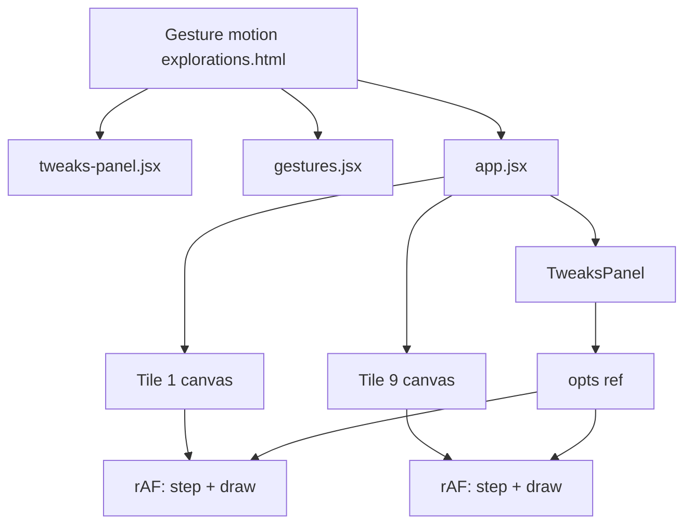
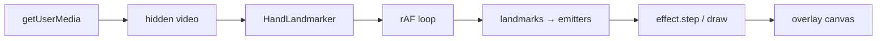

# Visuals reference (v2 design target)

The [`visuals/`](../visuals/) directory holds a **standalone design prototype** from Claude design tools. It is **not** part of the v1 app build (`pnpm dev` / `pnpm build`). Use it as the style and architecture reference when implementing animated effects driven by hand landmarks.

**North star:** Replace or augment the skeleton overlay with bio-luminescent, smoky canvas effects whose motion is influenced by the user's fingers.

---

## How to view

Open the gallery in a browser with a static file server (Babel fetches `.jsx` at runtime):

```bash
pnpm dlx serve visuals
# then open http://localhost:3000/Gesture%20motion%20explorations.html
```

Or any local static server pointed at the `visuals/` folder.

The page shows a **3×3 grid** of live animations plus a floating **Tweaks** panel (speed, intensity, opacity, glow, trail persistence, stream colour).

---

## File map

| File | Status | Purpose |
|------|--------|---------|
| [`Gesture motion explorations.html`](../visuals/Gesture%20motion%20explorations.html) | Active entry | Page shell, grid layout, loads scripts |
| [`app.jsx`](../visuals/app.jsx) | Active | React app: 3×3 tiles, per-tile rAF loops, Tweaks panel |
| [`gestures.jsx`](../visuals/gestures.jsx) | Active | Nine gesture classes + `GESTURES` registry |
| [`tweaks-panel.jsx`](../visuals/tweaks-panel.jsx) | Active | Reusable tweak UI (`useTweaks`, sliders, color chips) |
| [`animations.js`](../visuals/animations.js) | Orphan | Earlier factory-function implementation; **not loaded** by HTML |
| [`panel.jsx`](../visuals/panel.jsx) | Orphan | Tweaks panel for `animations.js`; **not loaded** |

When porting to production, treat **`gestures.jsx` as canonical**. Ignore `animations.js` / `panel.jsx` unless consolidating deliberately.

---

## The nine styles (canonical set)

Registry order matches the grid: top-left → bottom-right.

| # | ID | Name | Description | Best finger hook |
|---|-----|------|-------------|------------------|
| 1 | `dendrite` | Dendrite | Branching lightning from bottom roots | Emit bolts from fingertip downward |
| 2 | `constellation` | Constellation | Drifting nodes + proximity threads | Fingertip as node; trail follows tip |
| 3 | `fractures` | Fractures | Chaotic crackling web | Spawn cracks at tip position |
| 4 | `wisps` | Wisps | Rising smoke ribbons | Tip emits upward wisps |
| 5 | `neural` | Neural | Branching tree with ring junctions | Tip as growth origin |
| 6 | `fibrous` | Fibrous | Vertical swaying fiber field | Tip perturbs nearby fibers |
| 7 | `rings` | Rings | Soft luminous loops in curl flow | Tip spawns or attracts rings |
| 8 | `burst` | Burst | Radial smoke from center | Move emitter to fingertip |
| 9 | `swirl` | Swirl | Entwined loops + smoke ribbons | Tip as flow attractor |

Each tile caption in the HTML repeats the one-line description from `gestures.jsx`.

---

## Shared aesthetic

Design constraints repeated across comments and implementation:

- **Stage:** near-black (`#07080b` page, `#000` canvas) — aligned with v1 stage `#0a0a0a`
- **Palette:** white hot cores, tinted halos (configurable stream colour)
- **Trails:** per-frame semi-transparent black fade, then additive draw (`globalCompositeOperation = 'lighter'`)
- **Motion:** cheap sum-of-sines noise + approximate **curl noise** (divergence-free 2D flow)
- **Lifecycle:** ephemeral — spawn, grow, fade; nothing stays static

Tweak defaults in `app.jsx` (design-time starting point):

```javascript
{ speed: 3, opacity: 0.72, intensity: 2.5, trail: 0.23, glow: 20, hex: "#ffffff" }
```

---

## Gesture API (porting contract)

Each gesture in `gestures.jsx` is a class extending `GestureBase`:

```javascript
class GestureBase {
  constructor(w, h)           // canvas CSS pixel size
  resize(w, h)                // optional reseed on dimension change
  step(dt, opts)              // advance simulation
  draw(ctx, opts)             // render one frame (includes trail fade)
}
```

**`opts` shape** (passed every frame from `app.jsx`):

| Field | Type | Role |
|-------|------|------|
| `speed` | number | Time scale |
| `color` | `[r, g, b]` | Stream tint (0–255) |
| `opacity` | number | Overall alpha |
| `intensity` | number | Spawn rate / density multiplier |
| `trail` | number | Fade amount per frame (higher = shorter trails) |
| `glow` | number | Shadow blur / halo size (px) |

`GestureBase.fade()` and `GestureBase.trail()` implement the shared smoke look. New effects should reuse these helpers when possible.

---

## Runtime architecture (prototype)



- Each tile: 280×440 CSS px, HiDPI capped at 1.6×, **independent** rAF loop.
- `opts` stored in a ref so slider changes apply without React re-render per frame.
- **No MediaPipe** — all motion is autonomous or field-driven.

Production will run **one** full-stage effect on the main overlay canvas, not nine parallel loops.

---

## Gap vs v1 app

| | v1 (`src/`) | `visuals/` |
|--|-------------|------------|
| Stack | Vite + TypeScript | React 18 + Babel in-browser |
| Input | MediaPipe, 21 landmarks × 2 hands | None |
| Output | Skeleton lines + dots | Particle / energy effects |
| Build | `pnpm dev` / `pnpm build` | Static HTML + CDN scripts |
| Scope | Locked in [implementation-plan.md](./implementation-plan.md) | Explicitly post-v1 |

Current render path: `loop.ts` → `drawSkeleton()` in `draw.ts`. v2 adds an effects layer (replace or draw beneath/over skeleton).

---

## Suggested integration path (v2)

Not implemented. Intended direction when effects are requested:

1. **Port one gesture** to TypeScript (e.g. `src/effects/constellation.ts`) using the `step` / `draw` contract.
2. **Map landmarks to emitters** via existing `mx()` / `my()` in `landmarks.ts` (landmark 8 = index tip is the usual anchor).
3. **Extend `opts` with input**, e.g. `emitters: { x, y, handIndex }[]` updated each frame from grace-aware hand slots in `loop.ts`.
4. **Wire the render loop:** after detection, call `effect.step(dt, opts)` then `effect.draw(ctx, opts)` instead of or in addition to `drawSkeleton()`.
5. **Map hand signals to parameters:** finger spread → `intensity`; tip velocity → `speed`; per-hand colour from `HAND_COLORS`.



### Landmark indices (quick ref)

| Index | Joint |
|-------|-------|
| 0 | Wrist |
| 4, 8, 12, 16, 20 | Thumb, index, middle, ring, pinky tips |
| 8 | Index tip — default primary emitter |

---

## Design-tool coupling

`tweaks-panel.jsx` includes hooks for Claude edit mode (`postMessage` types `__edit_mode_*`, `__edit_mode_set_keys`). These persist tweak defaults inside `/*EDITMODE-BEGIN*/` blocks in source files.

**Do not port that protocol to production.** For the main app, use ordinary in-app controls or build-time constants if needed.

---

## Orphan implementation note

`animations.js` defines a parallel set (`Plasma Web`, `Particle Drift`, `Fracture`, …) with factory functions and `window.__streams` global state. Visual language matches `gestures.jsx` but APIs differ. Prefer the class-based registry in `gestures.jsx` for new work to avoid maintaining two systems.

---

## Related docs

- [implementation-plan.md](./implementation-plan.md) — v1 scope; "Later" features this reference targets
- [building-hand-gesture-tracking.md](./building-hand-gesture-tracking.md) — earlier gesture/effect architecture (trails, particles, dual canvas)
