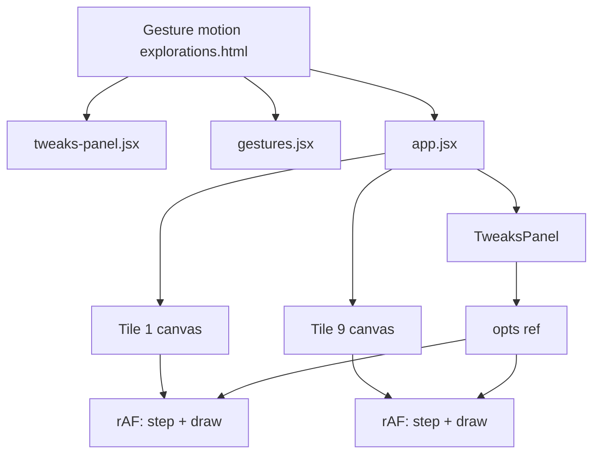
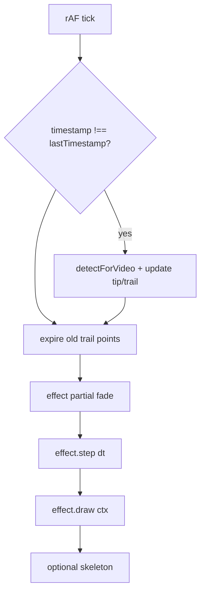
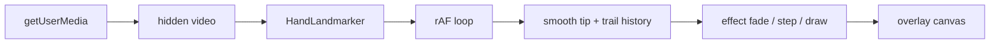

# Visuals reference (v2 design target)

The [`visuals/`](../visuals/) directory holds a **standalone design prototype** from Claude design tools. It is **not** part of the v1 app build (`pnpm dev` / `pnpm build`). Use it as the style and architecture reference when implementing animated effects driven by hand landmarks.

**North star:** Replace or augment the skeleton overlay with bio-luminescent, smoky canvas effects whose motion is influenced by the user's fingers.

---

## How to view

Open the gallery in a browser with a static file server (Babel fetches `.jsx` at runtime):

```bash
pnpm dlx serve visuals
# then open http://localhost:3000/Gesture%20motion%20explorations.html
```

Or any local static server pointed at the `visuals/` folder.

The page shows a **3×3 grid** of live animations plus a floating **Tweaks** panel (speed, intensity, opacity, glow, trail persistence, stream colour).

---

## File map

| File | Status | Purpose |
|------|--------|---------|
| [`Gesture motion explorations.html`](../visuals/Gesture%20motion%20explorations.html) | Active entry | Page shell, grid layout, loads scripts |
| [`app.jsx`](../visuals/app.jsx) | Active | React app: 3×3 tiles, per-tile rAF loops, Tweaks panel |
| [`gestures.jsx`](../visuals/gestures.jsx) | Active | Nine gesture classes + `GESTURES` registry |
| [`tweaks-panel.jsx`](../visuals/tweaks-panel.jsx) | Active | Reusable tweak UI (`useTweaks`, sliders, color chips) |
| [`animations.js`](../visuals/animations.js) | Orphan | Earlier factory-function implementation; **not loaded** by HTML |
| [`panel.jsx`](../visuals/panel.jsx) | Orphan | Tweaks panel for `animations.js`; **not loaded** |

When porting to production, treat **`gestures.jsx` as canonical**. Ignore `animations.js` / `panel.jsx` unless consolidating deliberately.

---

## The nine styles (canonical set)

Registry order matches the grid: top-left → bottom-right.

| # | ID | Name | Description | Best finger hook |
|---|-----|------|-------------|------------------|
| 1 | `dendrite` | Dendrite | Branching lightning from bottom roots | Emit bolts from fingertip downward |
| 2 | `constellation` | Constellation | Drifting nodes + proximity threads | Fingertip as node; trail follows tip |
| 3 | `fractures` | Fractures | Chaotic crackling web | Spawn cracks at tip position |
| 4 | `wisps` | Wisps | Rising smoke ribbons | Tip emits upward wisps |
| 5 | `neural` | Neural | Branching tree with ring junctions | Tip as growth origin |
| 6 | `fibrous` | Fibrous | Vertical swaying fiber field | Tip perturbs nearby fibers |
| 7 | `rings` | Rings | Soft luminous loops in curl flow | Tip spawns or attracts rings |
| 8 | `burst` | Burst | Radial smoke from center | Move emitter to fingertip |
| 9 | `swirl` | Swirl | Entwined loops + smoke ribbons | Tip as flow attractor |

Each tile caption in the HTML repeats the one-line description from `gestures.jsx`.

---

## Shared aesthetic

Design constraints repeated across comments and implementation:

- **Stage:** near-black (`#07080b` page, `#000` canvas) — aligned with v1 stage `#0a0a0a`
- **Palette:** white hot cores, tinted halos (configurable stream colour)
- **Trails:** per-frame semi-transparent black fade, then additive draw (`globalCompositeOperation = 'lighter'`)
- **Motion:** cheap sum-of-sines noise + approximate **curl noise** (divergence-free 2D flow)
- **Lifecycle:** ephemeral — spawn, grow, fade; nothing stays static

Tweak defaults in `app.jsx` (design-time starting point):

```javascript
{ speed: 3, opacity: 0.72, intensity: 2.5, trail: 0.23, glow: 20, hex: "#ffffff" }
```

---

## Gesture API (porting contract)

Each gesture in `gestures.jsx` is a class extending `GestureBase`:

```javascript
class GestureBase {
  constructor(w, h)           // canvas CSS pixel size
  resize(w, h)                // optional reseed on dimension change
  step(dt, opts)              // advance simulation
  draw(ctx, opts)             // render one frame (includes trail fade)
}
```

**`opts` shape** (passed every frame from `app.jsx`):

| Field | Type | Role |
|-------|------|------|
| `speed` | number | Time scale |
| `color` | `[r, g, b]` | Stream tint (0–255) |
| `opacity` | number | Overall alpha |
| `intensity` | number | Spawn rate / density multiplier |
| `trail` | number | Fade amount per frame (higher = shorter trails) |
| `glow` | number | Shadow blur / halo size (px) |

`GestureBase.fade()` and `GestureBase.trail()` implement the shared smoke look. New effects should reuse these helpers when possible.

---

## Runtime architecture (prototype)



- Each tile: 280×440 CSS px, HiDPI capped at 1.6×, **independent** rAF loop.
- `opts` stored in a ref so slider changes apply without React re-render per frame.
- **No MediaPipe** — all motion is autonomous or field-driven.

Production will run **one** full-stage effect on the main overlay canvas, not nine parallel loops.

---

## Gap vs v1 app

| | v1 (`src/`) | `visuals/` |
|--|-------------|------------|
| Stack | Vite + TypeScript | React 18 + Babel in-browser |
| Input | MediaPipe, 21 landmarks × 2 hands | None |
| Output | Skeleton lines + dots | Particle / energy effects |
| Build | `pnpm dev` / `pnpm build` | Static HTML + CDN scripts |
| Scope | Locked in [implementation-plan.md](./implementation-plan.md) | Explicitly post-v1 |

Current render path: `loop.ts` → `drawSkeleton()` in `draw.ts`. v2 adds an effects layer (replace or draw beneath/over skeleton).

---

## Suggested integration path (v2)

Not implemented. Intended direction when effects are requested:

### Phase 1 — Port one gesture

Port one style from `gestures.jsx` to TypeScript (e.g. `src/effects/fibrous.ts`) using the `step` / `draw` contract and shared helpers in `effectBase.ts`.

### Phase 2 — Track the finger and draw like the rainbow demo

**Reference implementation:** [MediaPipe Hand Tracking & Face Detection in JavaScript](https://www.sanderdesnaijer.com/blog/mediapipe-hand-face-tracking) (Step 6 — rainbow trail). Source: [`demos/mediapipe-rainbow/index.html`](https://github.com/sanderdesnaijer/demos/blob/main/demos/mediapipe-rainbow/index.html).

v2 effects should use the **same finger-tracking and draw-loop discipline** as that tutorial — not gesture classification (out of product scope), but the per-hand tip pipeline, grace handling, and “detect once / render every frame” split.

#### Per-hand tip state (camera pixel space)

Key state by **detection slot** (`0` | `1`), not handedness label:

| State | Purpose |
|-------|---------|
| `smoothTip[hi]` | Exponentially smoothed index tip `{ x, y }` |
| `tipTrail[hi]` | Time-stamped path `{ x, y, t }[]` for trail-following effects |
| `handMissed[hi]` | Consecutive frames without this slot (grace counter) |

Map landmark **8** (index tip) each detection frame:

```typescript
const rawX = mx(lm[8], camW);
const rawY = my(lm[8], camH);
```

`mx` / `my` in `landmarks.ts` already mirror X the same way as the blog (`MIRROR_X = true`).

#### Exponential smoothing (before recording or drawing)

Raw landmarks jitter. Blend toward the previous smoothed position **before** appending trail points or passing coords to an effect:

```typescript
const SMOOTH = 0.55; // 0 = raw, 1 = frozen; blog default ~0.5

smoothTip[hi] ??= { x: rawX, y: rawY };
smoothTip[hi].x = smoothTip[hi].x * SMOOTH + rawX * (1 - SMOOTH);
smoothTip[hi].y = smoothTip[hi].y * SMOOTH + rawY * (1 - SMOOTH);
const tipX = smoothTip[hi].x;
const tipY = smoothTip[hi].y;
```

Tune `SMOOTH` down (~`0.3`) if the column/trail feels laggy; up (~`0.7`) if it shimmers.

#### Trail point recording (rainbow rules)

When a hand slot is present (after grace), append the **smoothed** tip to `tipTrail[hi]` using the blog’s distance filters:

```typescript
const TELEPORT_DIST = 180;  // px — hand reappeared far away → start fresh
const MIN_POINT_DIST = 2;   // px — skip overdense points when moving slowly
const TRAIL_LIFETIME = 2200; // ms — expire old points (or rely on canvas fade)

const trail = tipTrail[hi];
const last = trail[trail.length - 1];
const dist = last ? Math.hypot(tipX - last.x, tipY - last.y) : 0;

if (!last || dist > TELEPORT_DIST) {
  tipTrail[hi] = [{ x: tipX, y: tipY, t: now }];
} else if (dist >= MIN_POINT_DIST) {
  trail.push({ x: tipX, y: tipY, t: now });
}
```

Unlike the blog, **do not gate recording on a `draw` gesture** — record whenever the slot is active. Product intent is continuous fingertip drive, not peace-sign / draw FSM.

#### Grace period (align with v1)

Reuse `GRACE_FRAMES = 6` from `landmarks.ts` (~200 ms at 30 fps):

- Reset `handMissed[hi] = 0` when slot `hi` appears in results.
- On miss, increment `handMissed[hi]`; only clear `smoothTip[hi]` and `tipTrail[hi]` after `handMissed[hi] > GRACE_FRAMES`.
- v1 already grace-holds **landmarks** in `loop.ts`; Phase 2 extends the same pattern to **tip smoothing and effect history** so a single dropped frame does not wipe the trail.

#### Render loop split (critical)

Match the blog’s two-speed loop:



| When | What runs |
|------|-----------|
| **New video frame only** | `detectForVideo`, grace update, smooth tip, append trail points |
| **Every rAF frame** | Expire aged points, `fade` + `step(dt)` + `draw(ctx)`, optional skeleton |

Effects must animate and fade **between** detections — same reason the rainbow stars fall and trail segments lose alpha even when `detectForVideo` skips a tick.

#### Drawing the effect (rainbow pattern → v2 visuals)

The blog draws on a **persistent** effects canvas: clear, redraw all trail segments with age-based alpha, Catmull-Rom splines offset perpendicular to path tangent for each colour band.

Adapt that pattern for `visuals/` aesthetics on the single overlay canvas:

1. **Persistence:** `effectBase.fade()` — semi-transparent black fill each frame (same role as the blog’s `fxCanvas` clear + age fade).
2. **Path effects** (constellation, dendrite, wisps): consume `tipTrail[hi]`; draw smooth segments with alpha from point age (`1 - age / TRAIL_LIFETIME`), optionally spline-interpolated between recorded tips.
3. **Column / field effects** (Fibrous): consume current `smoothTip[hi].x` (and optionally `y`) each frame — no spline, but still use smoothed coords and grace so the column does not jitter or vanish on one miss.
4. **Per-hand colour:** map slot → `HAND_COLORS` / `HAND_RGB` (blog uses a fixed 7-band rainbow palette per trail).

Full spline + normal-offset rendering from the blog lives in [building-hand-gesture-tracking.md §7.2](./building-hand-gesture-tracking.md#72-rainbow-trail-system) for reference; port only if an effect needs arc-shaped multi-band trails.

#### Phase 2 wiring in `loop.ts`

```typescript
// Inside timestamp guard — per present hand slot hi:
updateSmoothedTip(hi, lm, camW, camH, now);
appendTrailPoint(hi, now);

// Every frame — per hand slot with active or grace-held state:
expireTrailPoints(hi, now);
effect.fade(ctx);
effect.step(dt, { tip: smoothTip[hi], trail: tipTrail[hi], ...params });
effect.draw(ctx, { tip: smoothTip[hi], trail: tipTrail[hi], ...params });
```

### Phase 3 — Extend `opts` with input

Pass per-hand `{ tip, trail, handIndex }` into `step` / `draw` each frame (from grace-aware slots in `loop.ts`), plus scaled defaults from `defaultEffectParams()`.

### Phase 4 — Wire the render loop

After Phase 2, render order each frame: partial fade → effect `step` / `draw` per hand → optional skeleton (`S` key).

### Phase 5 — Map motion to parameters (optional)

Finger spread → `intensity`; tip velocity from `tipTrail` → `speed`; per-hand tint from `HAND_COLORS`.



### Landmark indices (quick ref)

| Index | Joint |
|-------|-------|
| 0 | Wrist |
| 4, 8, 12, 16, 20 | Thumb, index, middle, ring, pinky tips |
| 8 | Index tip — default primary emitter |

---

## Design-tool coupling

`tweaks-panel.jsx` includes hooks for Claude edit mode (`postMessage` types `__edit_mode_*`, `__edit_mode_set_keys`). These persist tweak defaults inside `/*EDITMODE-BEGIN*/` blocks in source files.

**Do not port that protocol to production.** For the main app, use ordinary in-app controls or build-time constants if needed.

---

## Orphan implementation note

`animations.js` defines a parallel set (`Plasma Web`, `Particle Drift`, `Fracture`, …) with factory functions and `window.__streams` global state. Visual language matches `gestures.jsx` but APIs differ. Prefer the class-based registry in `gestures.jsx` for new work to avoid maintaining two systems.

---

## Related docs

- [implementation-plan.md](./implementation-plan.md) — v1 scope; v2 Fibrous target
- [building-hand-gesture-tracking.md](./building-hand-gesture-tracking.md) — rainbow trail, smoothing, grace, dual-canvas patterns (§7–§9); canonical finger-tracking detail for Phase 2
- [MediaPipe rainbow demo tutorial](https://www.sanderdesnaijer.com/blog/mediapipe-hand-face-tracking) — live reference for tip smoothing, trail recording, and draw-loop split
